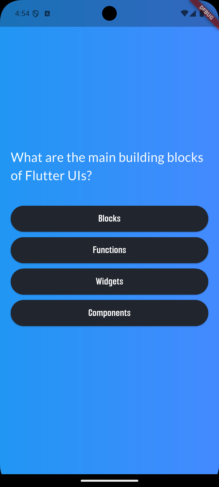

# ❓ quiz_app

A simple Flutter project that displays a multiple-choice quiz with shuffled questions.

## ✨ Features

- 📋 **Multiple Choice Questions**: Engaging quiz interface with selectable answer options.
- 🔀 **Shuffled Questions**: Each quiz session presents the questions in a randomized order.
- 🧩 **Score Tracking**: Tracks user score as they progress through the quiz.
- 📱 **Responsive Layout**: Optimized for various screen sizes with clean UI.

## 📸 Preview



## 🚀 Getting Started

### Prerequisites

- Flutter SDK installed
- Dart enabled
- An IDE like Android Studio, VSCode, etc.

### Run the app

```bash
flutter pub get
flutter run
